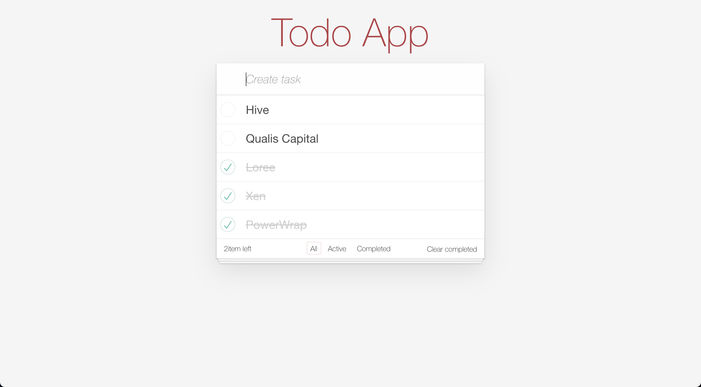

# Todos

##### Create a new project

With Style:
```
ng new Todos --style=scess
            or
ng new Todos
```

##### Run the application

```
ng serve ---port 9000
```



###### Creating a new Component with Angular CLI

```
ng generate component todo
```


###### Styling the todo app

```
npm install --save todomvc-app-css
```

###### Adding global styles to angular.json

/angular.json
```
"architect": {
  "build": {
    "options": {
      "styles": [
        "src/styles.scss",
        "node_modules/todomvc-app-css/index.css"
      ],
      "scripts": []
```

##### creating a service 
```
ng g service todo/todo
```

##### Development server

Run `ng serve` for a dev server. Navigate to `http://localhost:4200/`. The app will automatically reload if you change any of the source files.

##### Code scaffolding

Run `ng generate component component-name` to generate a new component. You can also use `ng generate directive|pipe|service|class|guard|interface|enum|module`.

##### Build

Run `ng build` to build the project. The build artifacts will be stored in the `dist/` directory. Use the `--prod` flag for a production build.

##### Running unit tests

Run `ng test` to execute the unit tests via [Karma](https://karma-runner.github.io).

##### Running end-to-end tests

Run `ng e2e` to execute the end-to-end tests via [Protractor](http://www.protractortest.org/).
